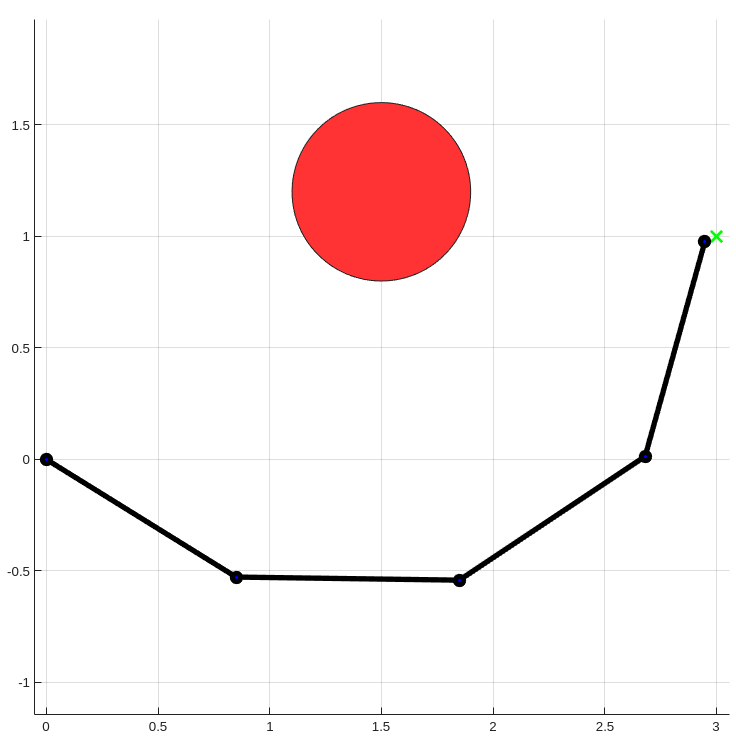

# Projet Méthode Numérique

On souhaite générer une trajectoire pour un bras robotique redondant à 4 degrés de liberté, en définissant un obstacle à une position donnée. La figure suivante donne la configuration du robot

<p align="center">
        
<p align="center">
    Configuration du robot : en bleu le bras, en vert l'objectif, en rouge l'obstacle
</p>

L’objectif est d’atteindre une position finale d’outil tout en esquivant un obstacle sur le chemin. Pour cela, on va “naviguer” dans le null-space afin de réaliser cet évitement.

## 1. Les maths

L’objectif est d’atteindre une position finale d’outil tout en esquivant un obstacle sur le chemin. Pour cela, on va “naviguer” dans le null-space afin de réaliser cet évitement.
Tel qu’est défini le robot, le modèle géométrique direct est trivial :

$$
\begin{bmatrix}
    x \\
    y 
\end{bmatrix} = 

\begin{bmatrix}
l1*\cos(\theta_1)+l2*\cos(\theta_1+\theta_2)+l3*\cos(\theta_1+\theta_2+\theta_3)+l4*\cos(\theta_1+\theta_2+\theta_3+\theta_4) \\
       l1*\sin(\theta_1)+l2*\sin(\theta_1+\theta_2)+l3*\sin(\theta_1+\theta_2+\theta_3)+l4*\sin(\theta_1+\theta_2+\theta_3+\theta_4)
\end{bmatrix}
  $$

Ce MGD permet d’obtenir le modèle cinématique direct défini par : 

$$
\dot{\mathbf{x}} = \mathbf{J}(\mathbf{q})\,\dot{\mathbf{q}}
$$

où la jacobienne J est définie comme :

$$
\mathbf{J} =
\begin{bmatrix}
\frac{\partial x}{\partial q_1} &
\frac{\partial x}{\partial q_2} &
\frac{\partial x}{\partial q_3} &
\frac{\partial x}{\partial q_4} \\[6pt]
\frac{\partial y}{\partial q_1} &
\frac{\partial y}{\partial q_2} &
\frac{\partial y}{\partial q_3} &
\frac{\partial y}{\partial q_4}
\end{bmatrix}
$$

Comme la jacobienne n’est pas inversible, on calcule la pseudo-inverse $J^+$ afin de pouvoir l'utiliser dans l'équation :

$$
\mathbf{q_{i+1}} = \mathbf{q_i} - \mathbf{J^+}F(\mathbf{q}) + (\mathbf{I}-\mathbf{J^+}\mathbf{J})*\mathbf{\alpha};
$$

où $F$ est définie comme $F:q→MGD(q)-x_{final}$ et $\alpha$ comme le coefficient d'amortissement qui permet d'influencer sur le null-space et permet d'effectuer la tâche d'évitement.

Ce coefficient $\alpha$ est optimisé par descente de gradient sur la distance entre le bras et l'obstacle.

Ainsi, fonctionner de cette manière permet au bras d'atteindre son objectif tout en évitant l'obstacle d'une manière optimisée.

## 2. Le code

Pour chaque itération :

### a) Cinématique directe

```matlab
p0 = [0;0];
p1 = p0 + L(1)*[cos(q(1)); sin(q(1))];
... % jusqu'à p4
```

* Calcule les positions de toutes les articulations et de l'effecteur grâce à la cinématique.

### b) Tâche principale : atteindre la cible

```matlab
error = target - p4;
x_dot = 0.5 * error;
```

* x_dot = vitesse désirée de l'effecteur.

### c) Jacobien de l'effecteur

```matlab
J = [...];
J_pinv = pinv(J);
```

* Jacobien 2x4 pour le bras.
* J_pinv = pseudo-inverse pour résoudre l'IK redondante.

### d) Tâche secondaire : optimisation d'alpha pour l'évitement

```matlab
alpha = zeros(4,1);
eps = 0.01;
for j = 1:4
    H_current = compute_cost(q,...);
    q_pert = q; q_pert(j) = q_pert(j)+eps;
    H_pert = compute_cost(q_pert,...);
    alpha(j) = -k_null * (H_pert - H_current)/eps;
end
```

* Calcule un gradient numérique du coût lié à l'obstacle.
* alpha = vecteur null-space qui pousse le bras à éviter l'obstacle sans interférer avec la tâche principale.

### e) Combinaison des mouvements

```matlab
q_dot = J_pinv*x_dot + (eye(4)-J_pinv*J)*alpha;
q = q + q_dot*dt;
```

* Combinaison de la tâche principale et de la tâche secondaire dans l'espace null.
